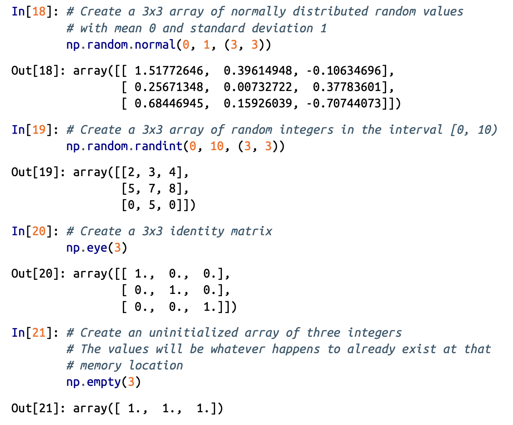

# Handbook Notes
----

## IPython

To view all the contents and help of a class:

e.g. **Numpy**

 - Content

   ```python
   
        import numpy as np
        np.<TAB>         # -> Press tab in place of <TAB>
   
    ```

- Help
  
  ```python
      
      import numpy as np
      np?               # -> Press ENTER
  
  ```


---


## NumPy
  Python library to deal with vectors and numeric calculation of muti-dimensional vectors. 

  - ### Array
    - NumPy arrays are **homogeneous**.
    - Defining NumPy arrays:

      ```python
      np.array(<list_obj>, dtype = "<data-type>" )
    
       # e.g.
        
      np.array([1,2,3,4,5], dtype = "int" )
      np.array([1.0,2,3,4,5], dtype = "float32" ) # python upcast the variables int -> float
    

        
        ```

    - Unlike Python lists, NumPy arrays can explicitly be multi-dimensional
       ```python
       np.array([range(i, i+3) for i in [1,4,7]])

       '''
           Output:

           array([[1, 2, 3],
                  [4, 5, 6],
                  [7, 8, 9]])
       '''


       
        ```
    - Create a length-10 integer array filled with zeros
      ```python
      np.zeros(10, dtype=int)

      # Output: array([0, 0, 0, 0, 0, 0, 0, 0, 0, 0])


      ```
    - Create a 3x5 floating-point array filled with 1s
      ```python
      np.ones((3, 5), dtype=float)

      '''
      Output:
      
      array([[ 1.,  1.,  1.,  1.,  1.],
                    [ 1.,  1.,  1.,  1.,  1.],
                    [ 1.,  1.,  1.,  1.,  1.]])
      '''
      
      ```
    - Create a 3x5 array filled with 3.14
      ```python
      np.full((3, 5), 3.14)

      '''
      Output: 

      array([[ 3.14,  3.14,  3.14,  3.14,  3.14],
                [ 3.14,  3.14,  3.14,  3.14,  3.14],
                [ 3.14,  3.14,  3.14,  3.14,  3.14]])
      '''


      ```
    - Create an array filled with a linear sequence.<br/>Starting at 0, ending at 20, stepping by 2.<br/>(this is similar to the built-in `range()` function)
      ```python
      np.arange(0, 20, 2)

      # Output: array([ 0,  2,  4,  6,  8, 10, 12, 14, 16, 18])


      
      ```
    - Create an array of five values evenly spaced between 0 and 1
      ```python
      np.linspace(0, 1, 5)

      # Output: array([0.  , 0.25, 0.5 , 0.75, 1.  ])


      ```
    - Create a 3x3 array of uniformly distributed. Random values between 0 and 1
      ```python
      np.random.random((3, 3))

      '''
      Output:

      array([[0.03087069, 0.53023831, 0.53067769],
       [0.71862767, 0.98513581, 0.27888605],
       [0.7427895 , 0.10858312, 0.23866072]])
      '''


      
      ```
      
        ---



    

  
